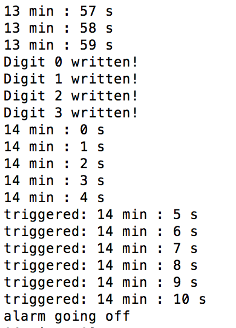

# Pseudo-mechanical clock
Author: Ellen Lo, 2019-09-18

## Summary
I designed an alarm clock which has the following hardware functionalities:
- pushbutton to restart alarm
- LED to alert alarm going off
- numerical display to show current time (hour and minute)
- servos as second hand and minute hand to show current time

## Implementation
The program keeps track of current time with 3 variables (*hour_count* and *minute_count* and *second_count*). It sets minute hand every minute and second hand every second via 2 servos respectively and updates time displayed on the alphanumerical display every minute. Timer 0 of timer group 1 (aka second timer) goes off every second to update *second_count* variable. Conditional statements are used to reset the 3 time tracking variables when they hit its maximum value - 23 for *hour_count*, and 59 for both *minute_count* and *second_count*.

To restart alarm, user presses pushbutton and hence setting the reset flag. Once reset flag is set, timer 0 of timer group 0 (which goes off at preset alarming period) starts counting.  As servo range is 90 degrees, each second tick increments servo angle by 1.5 degree until hitting 60 second limit. Once the time hits 60 seconds, minute hand increments by 15 degrees and second hand returns to its zero position. When time hits preset alarm interval, red LED blinks, reset flag is reset, and the program simply waits for user to start alarm again.

## Sketches and Photos
<!-- ### Wiring

### Console

Enter 4-digit binary number. Each digit corresponds to 1 LED. -->

## Modules, Tools, Source Used in Solution

## Supporting Artifacts
-[Video Demo]()
