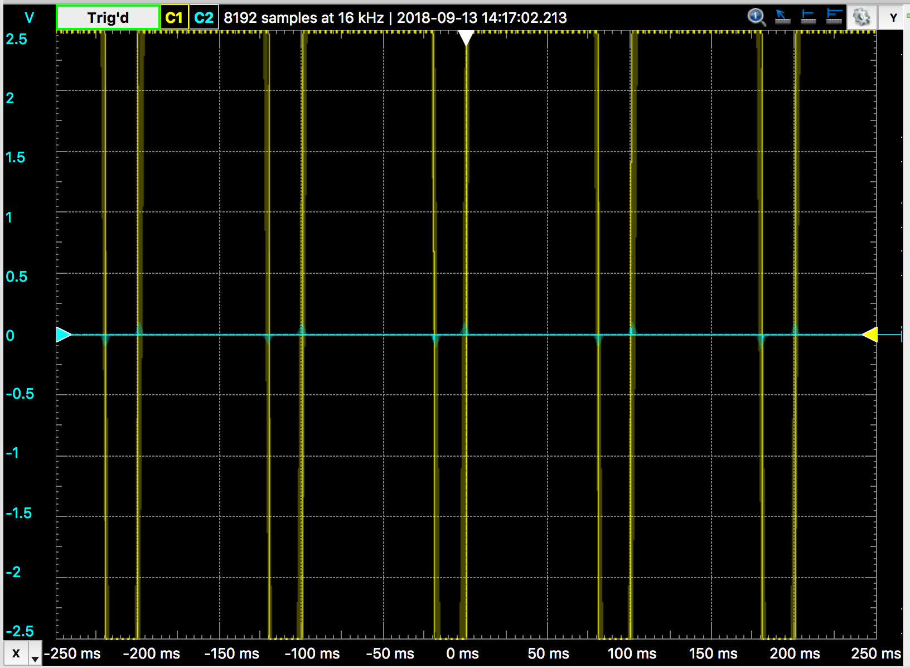

#  Introduction to tools

Author: Ellen Lo, 2019-09-06

## Summary
In this skill assignment, I successfully flashed ESP32 with example program Hello World and learnt about git version control (branching, creating pull requests, and merging).

## Sketches and Photos

### Git Onboard
Exercise 1

Exercise 2

### Analog Discovery

Waveform on oscilloscope with 1kHz frequency.

Waveform on oscilloscope with 10Hz frequency.

Spectrum analyzer with 1kHz frequency.

Spectrum analyzer with 10Hz frequency.

[LED with waveform generator demo](https://www.youtube.com/watch?v=u_IvrO4JbVY)
This video demonstrates LED lit up with 1kHz and 10Hz square wave.

### Setup Editors and IDEs

### Install ESP32 IDF and Toolchain
Hello World program on console

### Demonstrate Uploading Video to the Cloud
I chose Youtube to upload videos.

[LED PWM control demo](https://www.youtube.com/watch?v=Tmge6lqoqDs&feature=youtu.be)

-----

## Reminders
- Please remember to post a link to this report.md file on [Piazza](https://piazza.com/class/jja9ukam6dp48f)
- Repo is private
