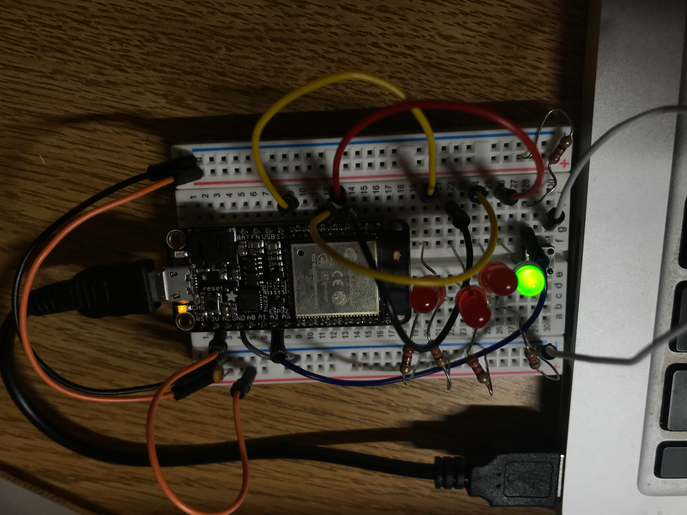

#  Pushbutton toggle LEDs (polling vs. interrupts)

Author: Ellen Lo, 2019-09-30

## Summary
In this skill assignment, I successfully polled state of button push as well as added interrupt handler to program for changing states of button push. The results are not significantly different in this project since the logic is simple. But interrupts is definitely a better way to handle pushbutton inputs as it allows low power mode.

## Sketches and Photos
### Wiring

When pushbutton is pressed, global variable *led* is incremented to set one LED on. First red light is wired to GPIO 12, second red light is wired to GPIO 14, the third red light is wired to GPIO 15, and the last green light is wired to GPIO 32.

## Modules, Tools, Source Used in Solution
-[esp-idf leds example](https://github.com/espressif/esp-idf/tree/affe75a10250564353d088f6b9a74dbb6f1ea0df/examples/get-started/blink)

-[esp-idf gpio interrupt handler example](https://github.com/espressif/esp-idf/blob/affe75a10250564353d088f6b9a74dbb6f1ea0df/examples/peripherals/gpio/main/gpio_example_main.c)

## Supporting Artifacts
-[Video Demo](https://youtu.be/dWanXNzeG-0)
