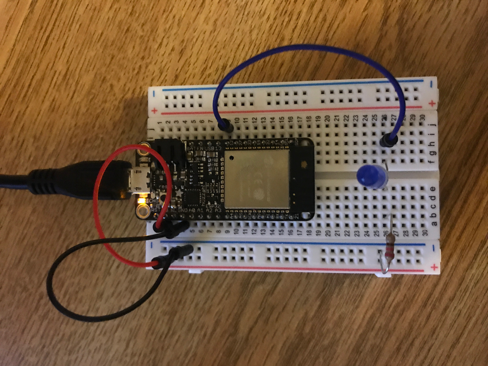
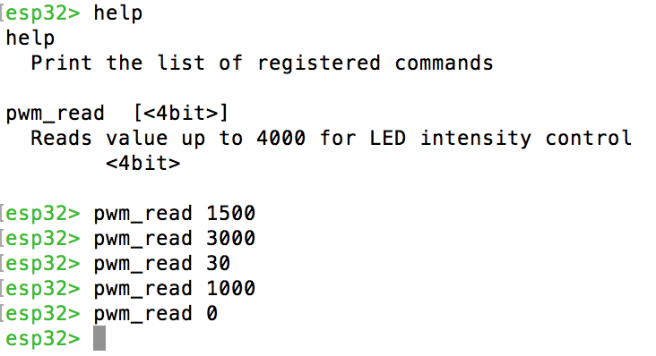

#  Use PWM to control power delivery to LEDs

Author: Ellen Lo, 2019-09-08

## Summary
In this skill assignment, I successfully controlled LEDs with PWM through console.

## Sketches and Photos
### Wiring

### Console

Enter value up to 4000 for LED intensity control. Color change is not big from 3000 to 4000.

## Modules, Tools, Source Used in Solution
-[esp-idf leds control example](https://github.com/espressif/esp-idf/tree/affe75a10250564353d088f6b9a74dbb6f1ea0df/examples/peripherals/ledc)

## Supporting Artifacts
-[Video Demo](https://youtu.be/Tmge6lqoqDs)
