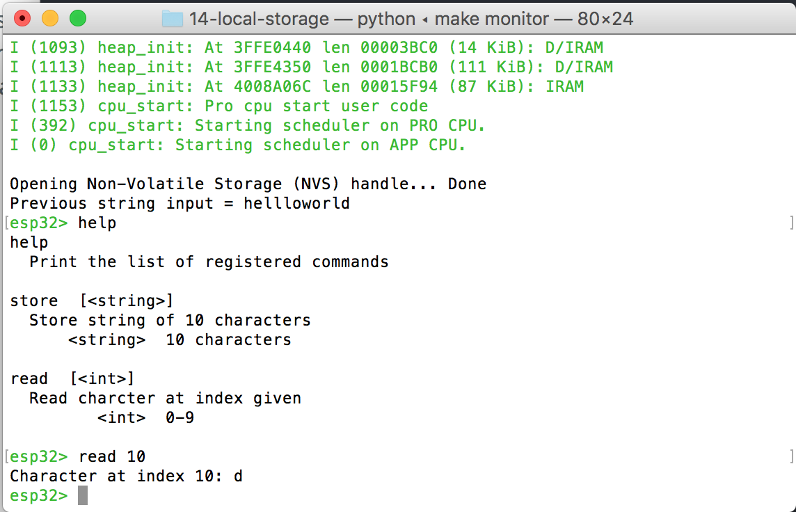

#  NVS (non volatile storage)

Author: Ellen Lo, 2019-10-24

## Summary
In this skill assignment, I successfully used NVM (non volatile memory) of ESP32 to store character strings of variable length (could be longer than 10 characters!). String from local memory is read at the start of program and is stored in global variable *inputStr*. User interface with 2 custom commands is built on console. Command *store* takes string input and and saves it as global variable *outputStr*, and command *read* takes an integer input and uses it as index to read from *inputStr*. If user types *exit*, simply checked with string comparison rather than a command registration, system restarts and stores *outputStr* into non volatile memory.

## Sketches and Photos
### Console

Reading the 10th index, or 11th character, of character string.
(Ignore the descriptions of commands on help)

## Modules, Tools, Source Used in Solution
-[esp-idf nvs_rw_value example](https://github.com/espressif/esp-idf/tree/7c29a39/examples/storage/nvs_rw_value)

## Supporting Artifacts
-[Video Demo](https://youtu.be/n1yyxWRNHwY)
