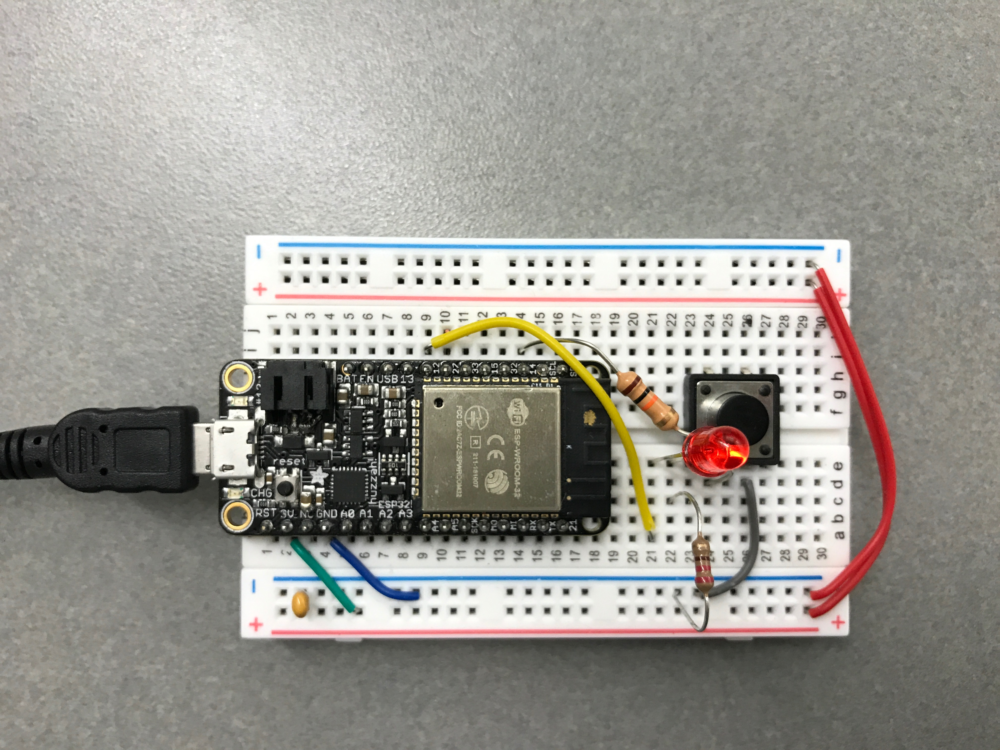
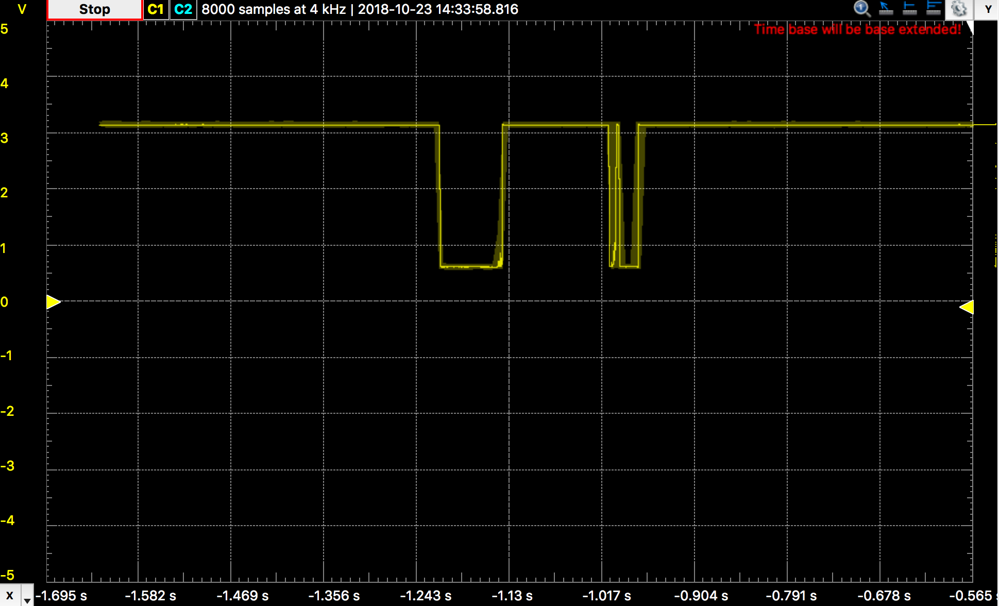
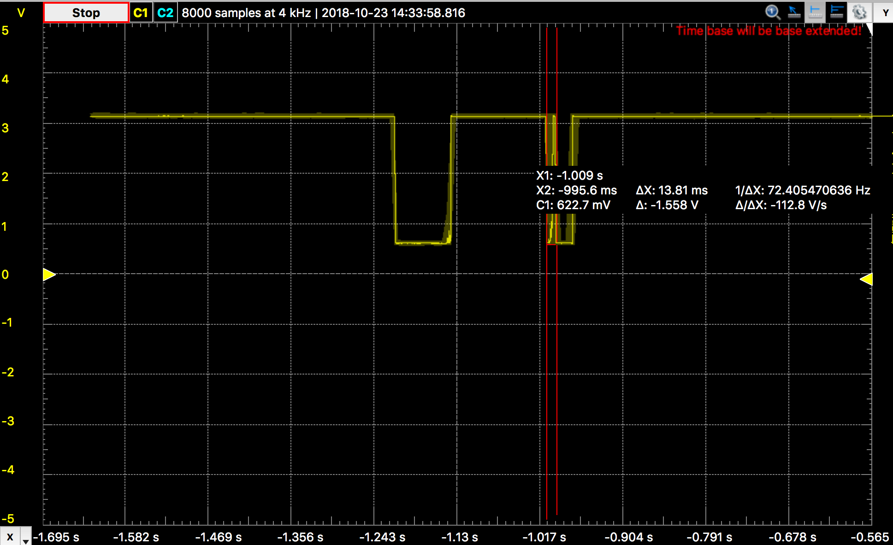

#  Debounce switch

Author: Ellen Lo, 2019-10-23

## Summary
In this skill assignment, I successfully debounced a switch and showed the results with an LED. With Analog Discovery, I found that the settling time is pretty short, around 15ms. Incorporating this information with the program, I used a global variable *btnInit* to track if button has been pressed in the past 15ms. If not, set this variable to true and toggle the LED. If *btnInit* is set, it means that there is a bounce and hence skips its default operations. After experimenting, I also found that the settling time found with Analog Discovery is not constant and hence in the main program I set it to 80ms.

## Sketches and Photos
### Wiring

### Result on Analog Discovery Scope

The first falling edge did not bounce and the second bounced as changing signals can be observed even when there is no change in button action.

## Modules, Tools, Source Used in Solution
-[esp-idf leds example](https://github.com/espressif/esp-idf/tree/affe75a10250564353d088f6b9a74dbb6f1ea0df/examples/get-started/blink)

-[esp-idf gpio interrupt handler example](https://github.com/espressif/esp-idf/blob/affe75a10250564353d088f6b9a74dbb6f1ea0df/examples/peripherals/gpio/main/gpio_example_main.c)

## Supporting Artifacts
-[Video Demo](https://www.youtube.com/watch?v=OtFLpTJ9FD0)
