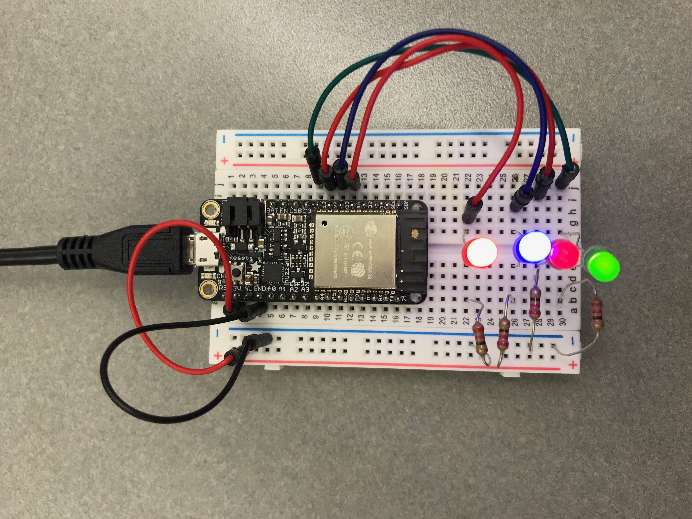
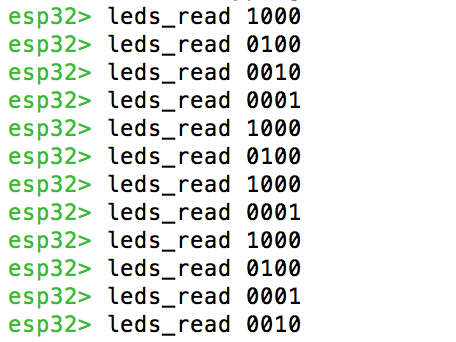

#  Use GPIO to control LEDs

Author: Ellen Lo, 2019-09-07

## Summary
In this skill assignment, I successfully controlled LEDs with GPIO signals via console.

## Sketches and Photos
### Wiring

### Console

Enter 4-digit binary number. Each digit corresponds to 1 LED.

## Modules, Tools, Source Used in Solution
-[esp-idf leds example](https://github.com/espressif/esp-idf/tree/affe75a10250564353d088f6b9a74dbb6f1ea0df/examples/get-started/blink)

-[esp-idf console example](https://github.com/espressif/esp-idf/tree/affe75a10250564353d088f6b9a74dbb6f1ea0df/examples/system/console)

## Supporting Artifacts
-[Video Demo](https://youtu.be/DgJuB904x20)
