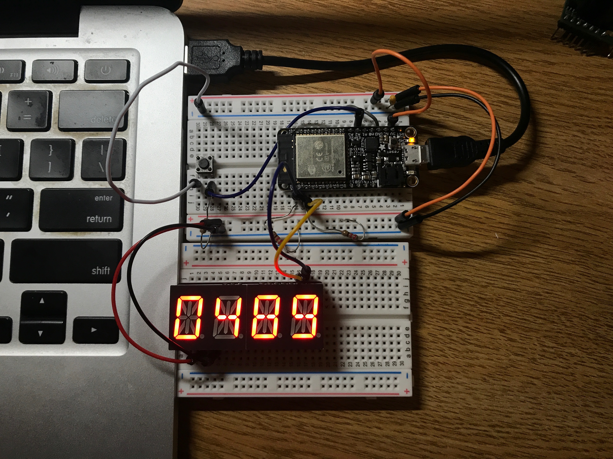

#  Stopwatch with alphanumeric display and pushbutton

Author: Ellen Lo, 2019-09-30

## Summary
In this skill assignment, I was able to implement a stopwatch with start, pause, and reset timer functions. The user input is pushbutton to switch timer states and output is alphanumeric display which shows timer increments.

AlphaDisplay.c was designed to be a reusable code from alphanumeric display skill, and this stopwatch module uses alphanumeric display functions by importing "alpha.h" library. Functions to initialize display and write digits are available for main code. In function *writeDigit(uint8_t nth, uint8_t num)*, where *nth* refers to the number of digit it is writing to and *num* refers to the ascii number of input character or integer, the program uses input ascii number to look up number table, which stores all bitmaps of ascii-compatible numbers, and sets buffer at odd numbered address (0x71, 0x73, 0x75, and 0x77) for master device to send to slave. Only odd numbered addresses are used in this case because the more significant 8 bits are not required to display numbers (as they are to display characters).

## Sketches and Photos
### Code

setTime() is the function that calls alphanumeric display library function writeDigit(nth, num). According to global variable *second_count* which increments per second when timer is started, respective digits are set to corresponding unit of second_count.

### Display

Counts from 1 to 9999.

## Modules, Tools, Source Used in Solution
-[esp-idf i2c example](https://github.com/espressif/esp-idf/tree/affe75a10250564353d088f6b9a74dbb6f1ea0df/examples/peripherals/i2c)

-[Arduino Wire.h code](https://github.com/esp8266/Arduino/blob/master/libraries/Wire/Wire.h)

-[LED backpack github](https://github.com/adafruit/Adafruit_LED_Backpack/blob/master/Adafruit_LEDBackpack.cpp)

-[Custom alphanumeric display library](https://github.com/BU-EC444/Lo-Ellen/tree/master/skills/3-sensor-actuator/Code/alpha-display)

## Supporting Artifacts
-[Video Demo](https://youtu.be/AJvFjqGk_ls)
