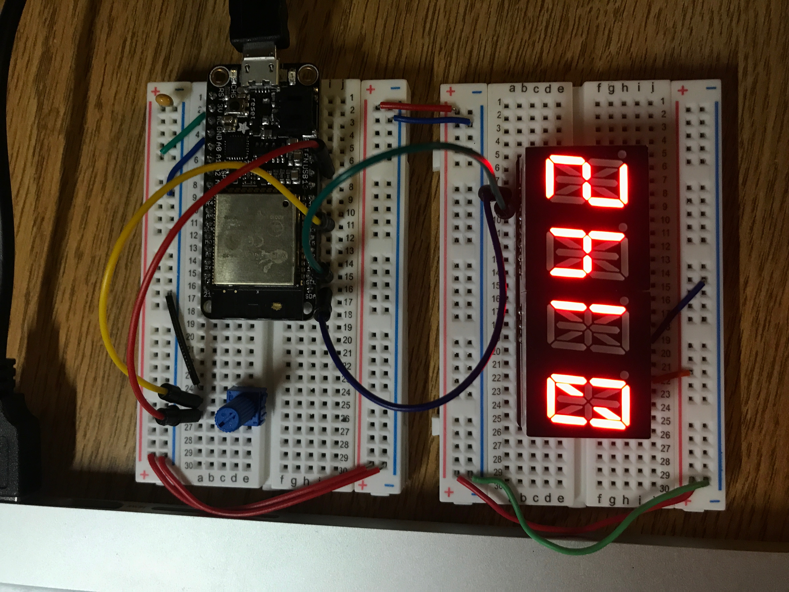

#  Battery monitor

Author: Ellen Lo, 2018-11-4

## Summary
In this skill assignment, I was able to monitor usb battery of esp32 with a variable resistor, essentially a trimpot, and display the results on an alphanumeric display.

## Sketches and Photos
### Wiring

The trimpot is powered with 5V input, with the middle pin connected to GPIO #33. The result shown on alphanumeric display is in millivolts.

## Modules, Tools, Source Used in Solution
-[esp-idf adc example](https://github.com/espressif/esp-idf/tree/affe75a10250564353d088f6b9a74dbb6f1ea0df/examples/peripherals/adc)

-[alpha display module](https://github.com/BU-EC444/Lo-Ellen/tree/master/skills/3-sensor-actuator/Code/15-alpha-display)

-[trimpot](https://www.sparkfun.com/products/9806)

## Supporting Artifacts
-[Video Demo](https://youtu.be/YztVshJGOgk)
