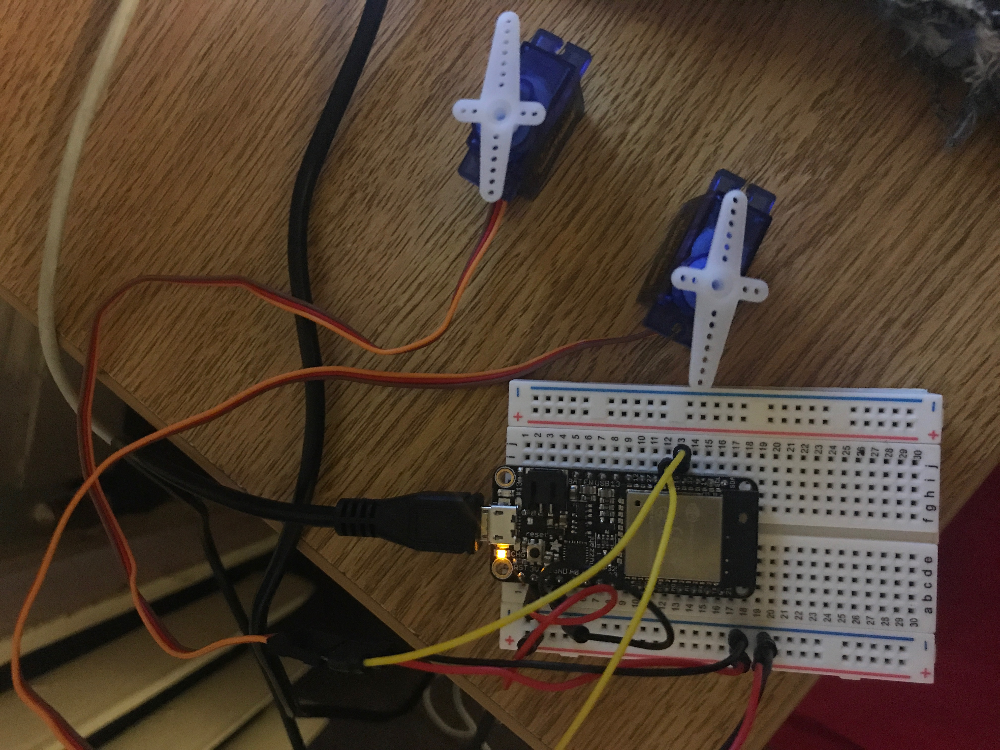
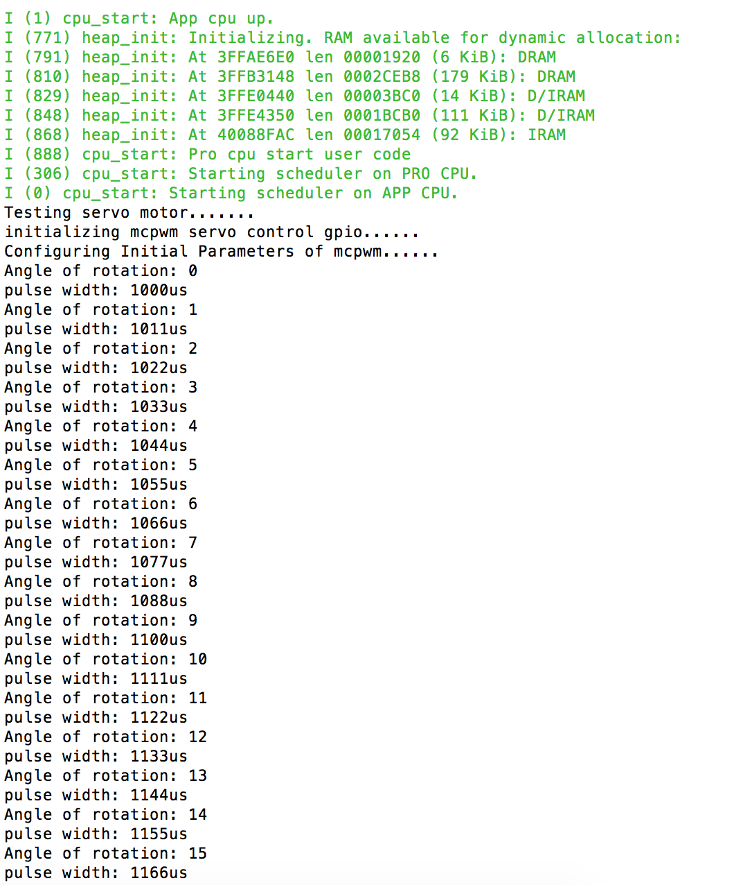

#  Two servos control

Author: Ellen Lo, 2019-09-11

## Summary
In this skill assignment, I got 2 servos running in parallel. Both of them run on channel 0, bound to timer 0; one on operator A and the other on operator B.

## Sketches and Photos
### Wiring

First servo is assigned to GPIO 15 and second servo is assigned to GPIO 32.

### Console

Prints out current angle on console.

## Modules, Tools, Source Used in Solution
-[esp-idf servo pwm example](https://github.com/espressif/esp-idf/tree/affe75a10250564353d088f6b9a74dbb6f1ea0df/examples/peripherals/mcpwm/mcpwm_servo_control)

-[MCPWM unit block diagram](https://docs.espressif.com/projects/esp-idf/en/latest/api-reference/peripherals/mcpwm.html)

## Supporting Artifacts
-[Video Demo](https://youtu.be/DMBLtDQ1yFM)
