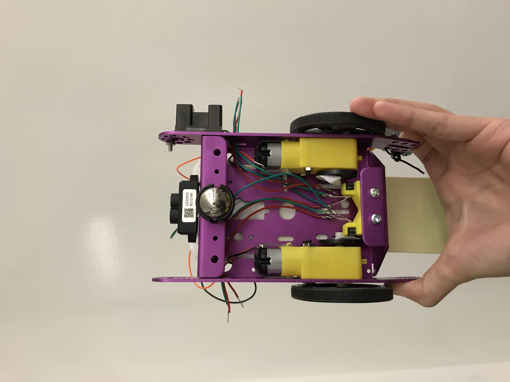

#  Assemble the car

Author: Ellen Lo, 2018-11-17

## Summary
In this skill assignment, I assembled the car. The images shown below are the assembled car used for quest 4. It consists of 2 motors, 2 wheel sensors, 2 wheels and tires, ball castor, esp board, 5V portable battery, breadboard, and H-bridge.

## Sketches and Photos
Front

Right

Top

Back

## Modules, Tools, Source Used in Solution
-[DC Motor skill 22](https://github.com/BU-EC444/Lo-Ellen/tree/master/skills/3-sensor-actuator/Code/22-dc-motor)
