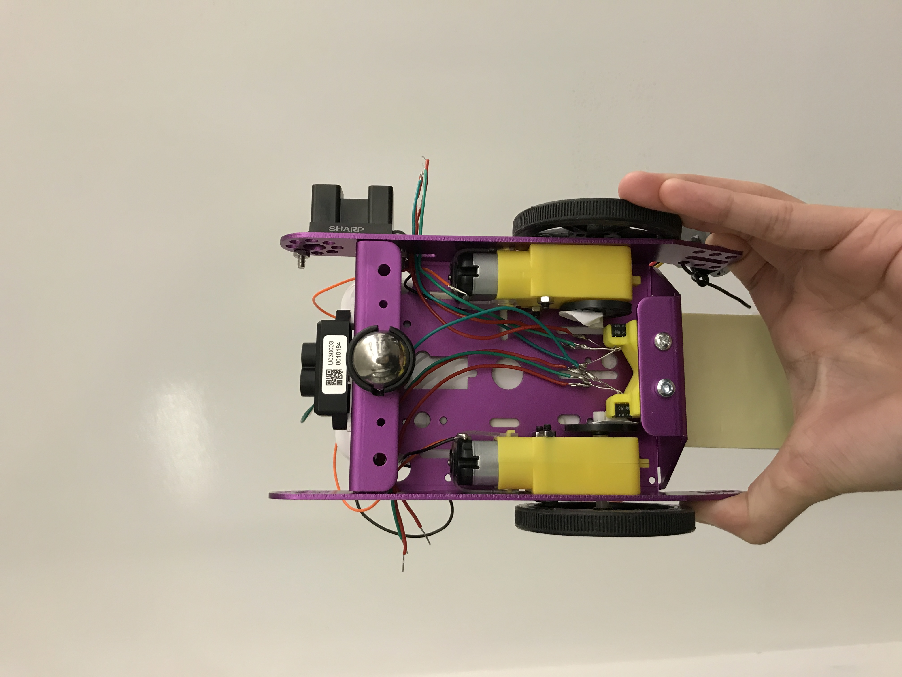

#  DC Motor

Author: Ellen Lo, 2018-11-17

## Summary
In this skill assignment, I got to drive dc motors with H-bridge. Although video demo doesn't show, the dc motors are able to turn clockwise as well as anticlockwise by giving it reverse logic.

## Sketches and Photos
Back of car

## Modules, Tools, Source Used in Solution
-[Video demo](https://youtu.be/Vp1VJNPytBY)
-[esp-idf mcpwm brushed dc control example](https://github.com/espressif/esp-idf/tree/11b444b8f493165eb4d93f44111669ee46be0327/examples/peripherals/mcpwm/mcpwm_brushed_dc_control)
