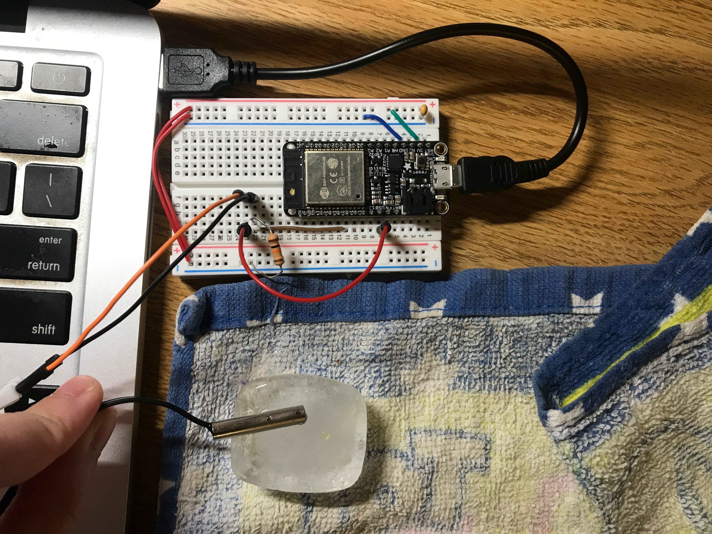
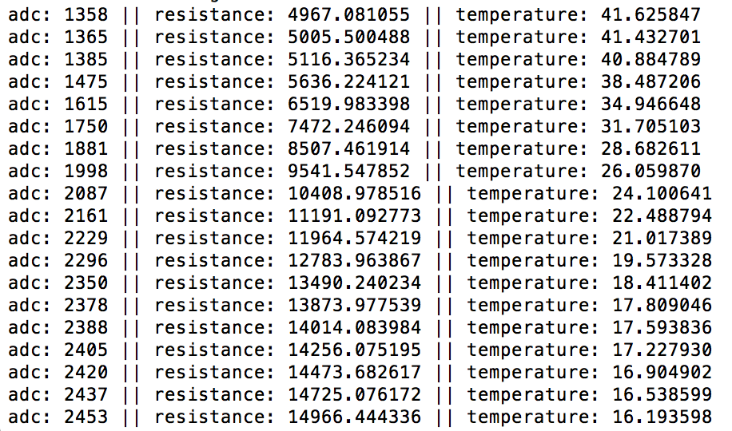

#  Thermistor

Author: Ellen Lo, 2018-11-04

## Summary
In this skill assignment, I was able to get temperature reading by converting adc reading with a voltage divider. I tested the sensor by placing it on ice and heater, and I realized that it's challenging to obtain a stable temperature reading instantly. The conversion of adc reading into the thermistor's resistance and then temperature is done with the Steinhart-Hart equation.

## Sketches and Photos
### Wiring

The thermistor is powered by USB power supply and grounded with a 10K ohm resistor. GPIO #33 is used to read voltage across thermistor.

### Console

## Modules, Tools, Source Used in Solution
-[esp-idf adc example](https://github.com/espressif/esp-idf/tree/affe75a10250564353d088f6b9a74dbb6f1ea0df/examples/peripherals/adc)

-[Using thermistor guide on adafruit](https://learn.adafruit.com/thermistor/using-a-thermistor)

## Supporting Artifacts
-[Video Demo](https://youtu.be/sJPjuTShZNw)
