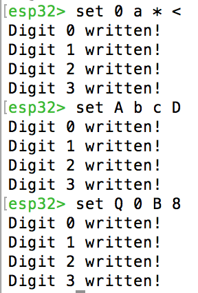

#  Alphanumeric display w/ keyboard input

Author: Ellen Lo, 2019-09-22

## Summary
In this skill assignment, I was able to provide input via keyboard to show on alphanumeric display. I used command *set* with 4 arguments of integer or single character (e.g. *set A b c D*).

AlphaDisplay.c is designed to be a reusable code for future alphanumeric display debugging purposes. By simply inserting alpha.h, functions to initialize and write digits to display are available for main loop. In function *writeDigit(uint8_t nth, uint8_t num)*, where *nth* refers to the number of digit it is writing to and *num* refers to the ascii number of input character or integer, the program uses input ascii number to look up alphafonttable, which stores all bitmaps of ascii-compatible characters, and sets buffer at address (0x71 to 0x78) for master device to send to slave. 

Because I learnt from ESP32 API reference that the data to be sent for *i2c_master_write* is of unsigned 8 bit integer data type, I wrote the result from 16 bit alphafonttable at address (0x71 | 0x73 | 0x75 | 0x77) and shifted right the result for address (0x72 | 0x74 | 0x76 | 0x78). [0x71 0x72] pair corresponds to first digit, [0x73 0x74] corresponds to second digit and so on for the last 2 digits.

## Sketches and Photos
### Console

3 examples of alphanumeric display shown below. Number on line below command is ascii number of the first digit set; just for debugging purposes.

### Display

See console image for commands.

## Modules, Tools, Source Used in Solution
-[esp-idf i2c example](https://github.com/espressif/esp-idf/tree/affe75a10250564353d088f6b9a74dbb6f1ea0df/examples/peripherals/i2c)

-[Arduino Wire.h code](https://github.com/esp8266/Arduino/blob/master/libraries/Wire/Wire.h)

-[LED backpack github](https://github.com/adafruit/Adafruit_LED_Backpack/blob/master/Adafruit_LEDBackpack.cpp)

## Supporting Artifacts
-[Video Demo](https://youtu.be/nVKqPdXi-6U)
