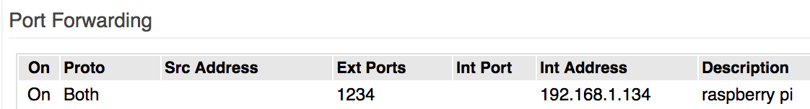
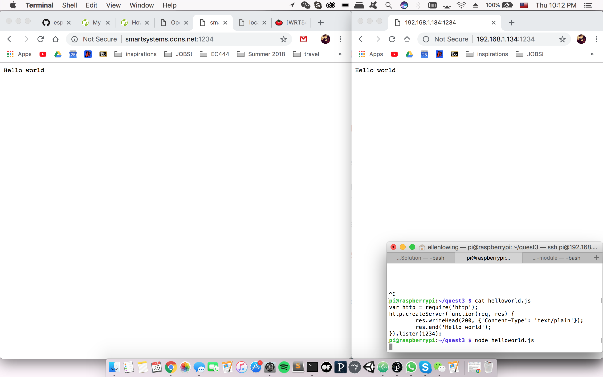
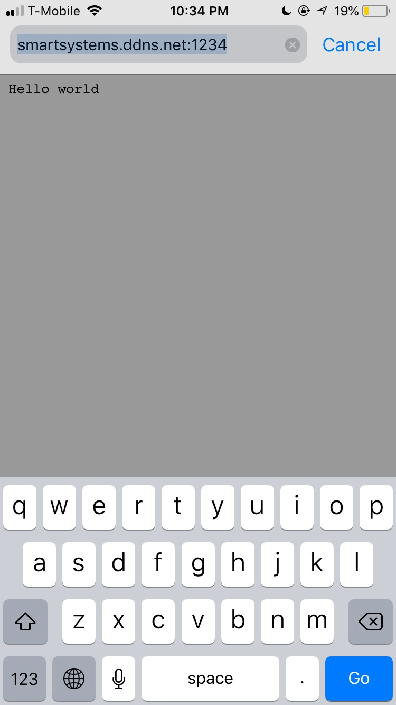

#  Dynamic DNS

Author: Ellen Lo, 2018-10-25

## Summary
In this skill assignment, I was able to connect to forward port with the Linksys router and access node server with hosted DDNS name. I used No-IP hosting services and chose *smartsystems.ddns.net* as the host name. By adding external ports under Port Forwarding section on router admin page, I was able to access node server started on my Mac, my phone as well as on raspberry pi.

## Sketches and Photos
#### Modules

## Modules, Tools, Source Used in Solution
-[No-IP](https://www.noip.com/)
-[Port checking tool](http://www.portchecktool.com/)
