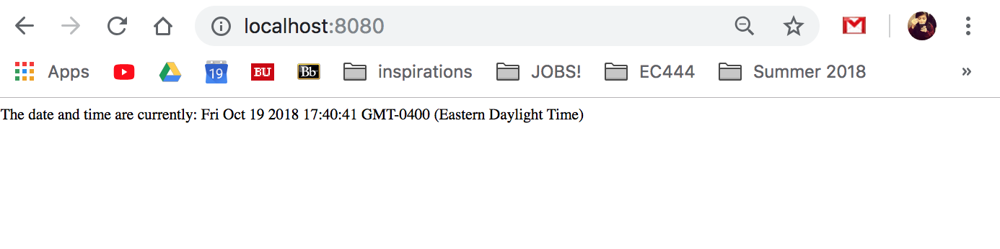
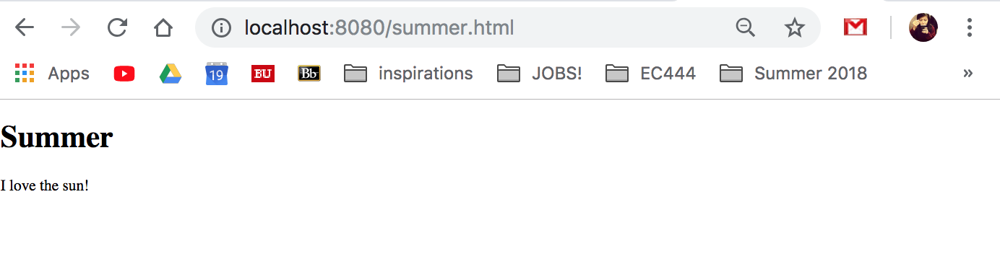
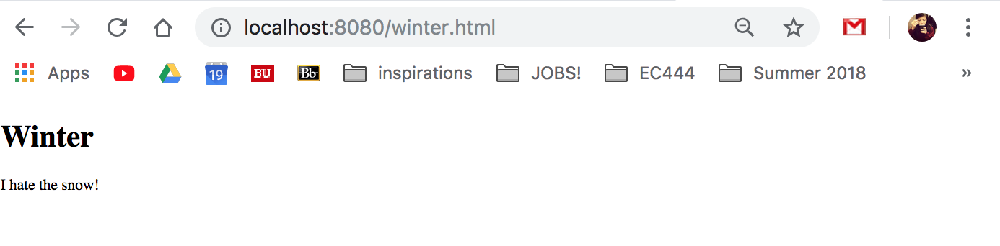
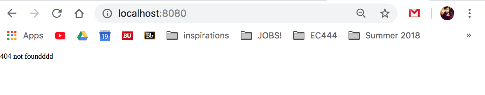
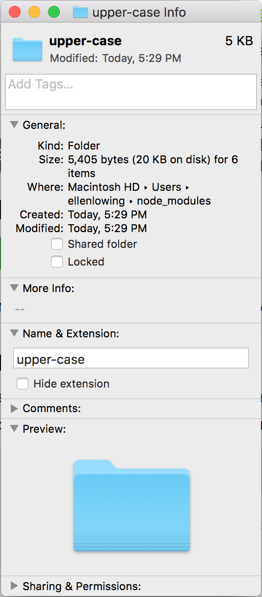
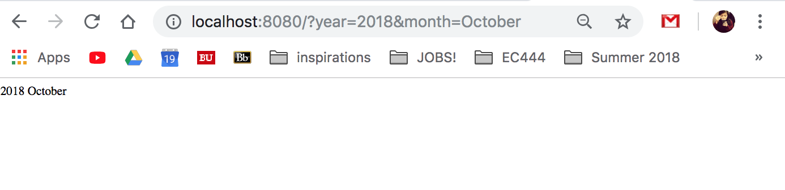

#  Nodejs

Author: Ellen Lo, 2018-10-19

## Summary
In this skill assignment, I was able to run javascript programs on a server with Node.js. I completed 5 modules (Modules, HTTP, URL, NPM, and Events) and documented the results below. This is a skill that will be later applied to raspberry pi in the online appliance quest.

## Sketches and Photos
#### Modules

I learnt to create a custom module and import it into another js program.

#### HTTP

I learnt to parse the query strings of url and write it as html content.

#### URL

I learnt to load file from filesystem that corresponds to parsed pathname and write it as html content. I also added error handler when file is not found.

#### NPM

I learnt to use npm to install modules and import them onto js program.

#### Events

I learnt to create custom event handler and event emitter with the events module. Here the program outputs "Loaded!" if the server is successfully created.

## Modules, Tools, Source Used in Solution
-[Nodejs tutorial on w3school](https://www.w3schools.com/nodejs/nodejs_get_started.asp)
