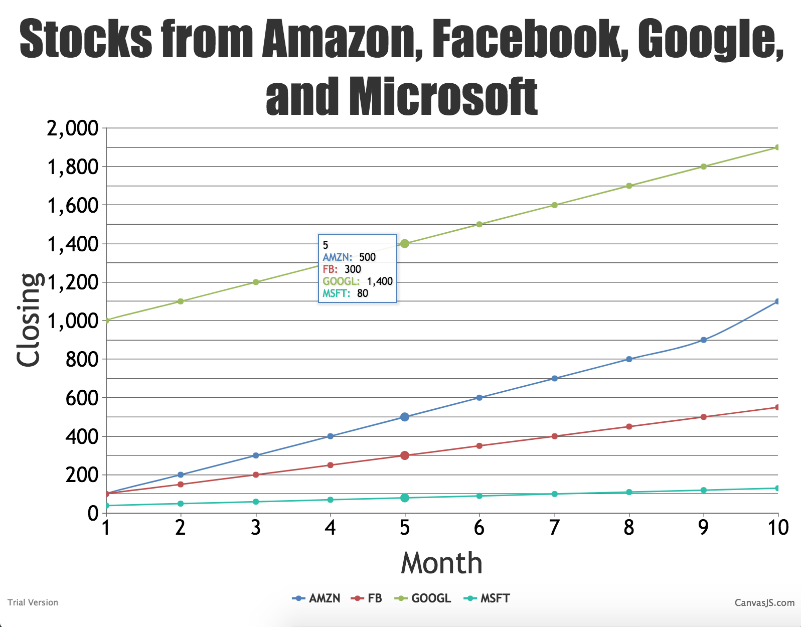

#  CanvasJS

Author: Ellen Lo, 2018-11-29

## Summary
In this skill assignment, I was able to design chart to read and display data from provided stocks data. I used ajax to load csv file so the site has to be hosted on web server (command prompt: 'php -S localhost:8000') to view result. I parsed the data by reading line by line and splitting each line with comma separator. Then, by comparing the stock name to "AMZN", "FB", "MSFT", or "GOOGL", I pushed data { x: date, y: closing } to respective stock's data points array.

## Sketches and Photos
#### Result

## Modules, Tools, Source Used in Solution
-[CanvasJS example](https://canvasjs.com/javascript-charts/multi-series-chart/)
