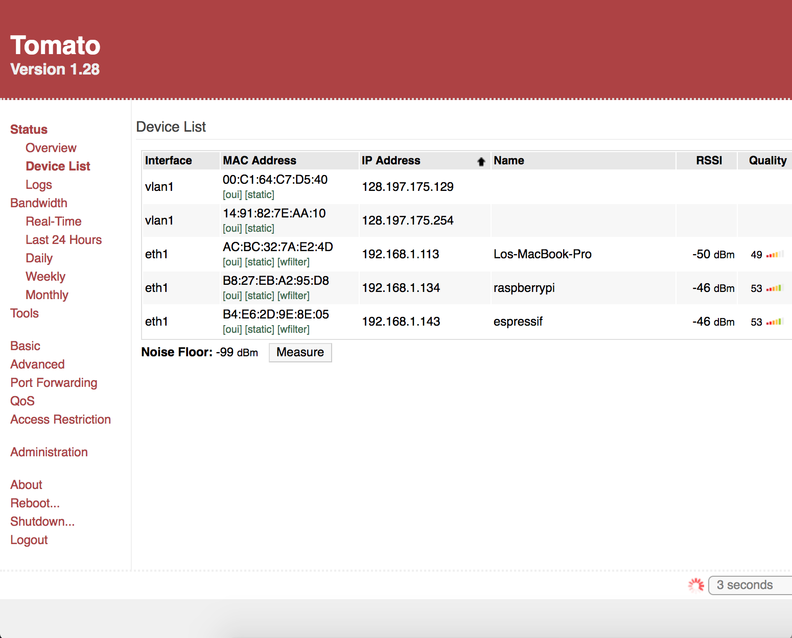

#  Router configuration

Author: Ellen Lo, 2018-11-5

## Summary
In this skill assignment, I was able to configure the router with Tomato and connect my devices remotely to Internet. I used the router with 'Group_17' label.

## Sketches and Photos
#### Modules

Here it shows that my raspberry pi and Macbook Pro is connected to 'Group_17' network.

## Modules, Tools, Source Used in Solution
