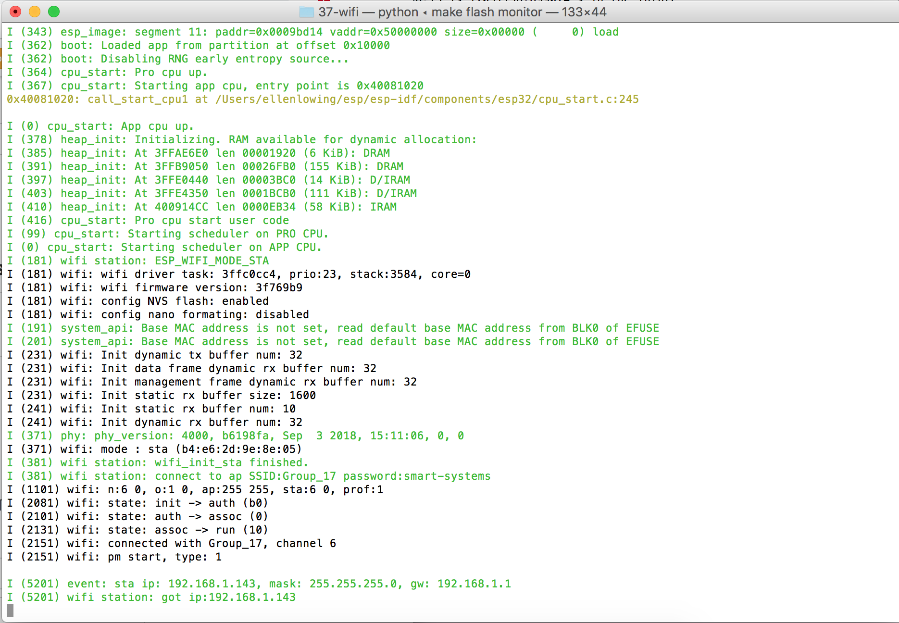
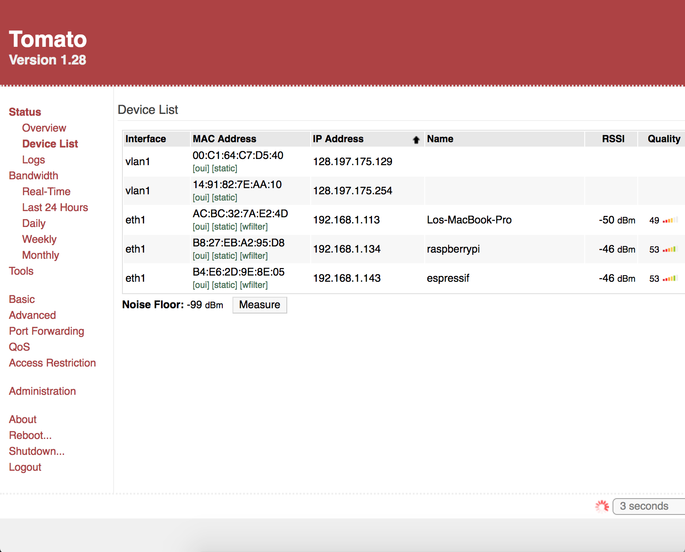

#  Wifi on esp32

Author: Ellen Lo, 2018-10-25

## Summary
In this skill assignment, I was able to connect to router wifi on esp32. To check for connection, IP address of esp32 is obtained on console and "espressif" is also shown as one of the devices connected to wifi on the router admin page.

## Sketches and Photos
#### Modules

## Modules, Tools, Source Used in Solution
-[esp-idf wifi station example](https://github.com/espressif/esp-idf/tree/affe75a10250564353d088f6b9a74dbb6f1ea0df/examples/wifi/getting_started/station)
