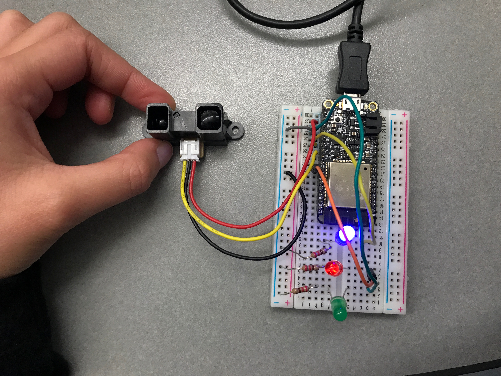
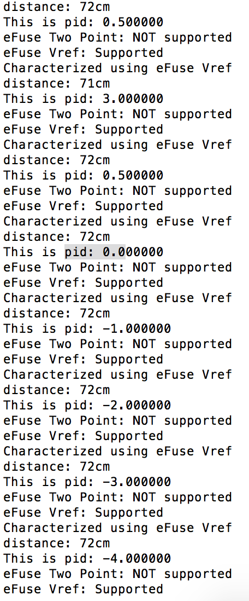

#  PID

Author: Ellen Lo, 2018-12-14

## Summary
In this skill assignment, I was able to evaluate accuracy of LIDAR with PID feedback control loop. A timing loop with 100ms duration is implemented to evaluate error signal from Lidar. Feedback is visualized with different colors --- if pid < 0, red light turns on, else if pid > 0, blue turns on, and if there is no error, green light turns on.

## Sketches and Photos
#### Wiring

#### Console

## Modules, Tools, Source Used in Solution
-[Video demo](https://youtu.be/Kf7AAfUuPeQ)
