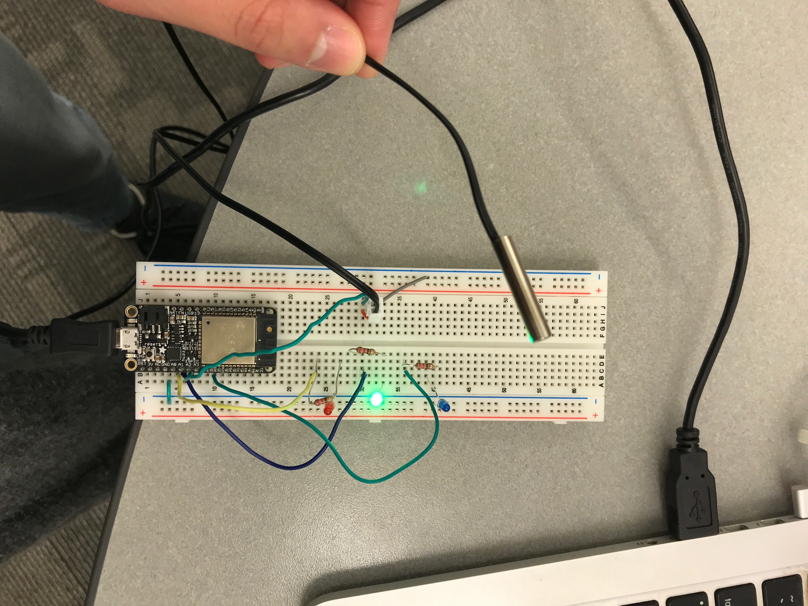

#  RTOS

Author: Ellen Lo, 2018-12-04

## Summary
In this skill assignment, I was able to utilize the features of real time operating system (RTOS). Three FreeRTOS tasks were created - the most prioritized task is getting adc values from temperature sensor every 100ms; the second most prioritized task is computing average over the 20 samples and writing to console every 2s; the least most prioritized task is detecting delta over last 2 values and setting LED to red for temperature increase, blue for temperature drop, and green for constant temperature.

## Sketches and Photos
#### Wiring

## Modules, Tools, Source Used in Solution
-[Video demo](https://youtu.be/TC_4N9n3xro)
