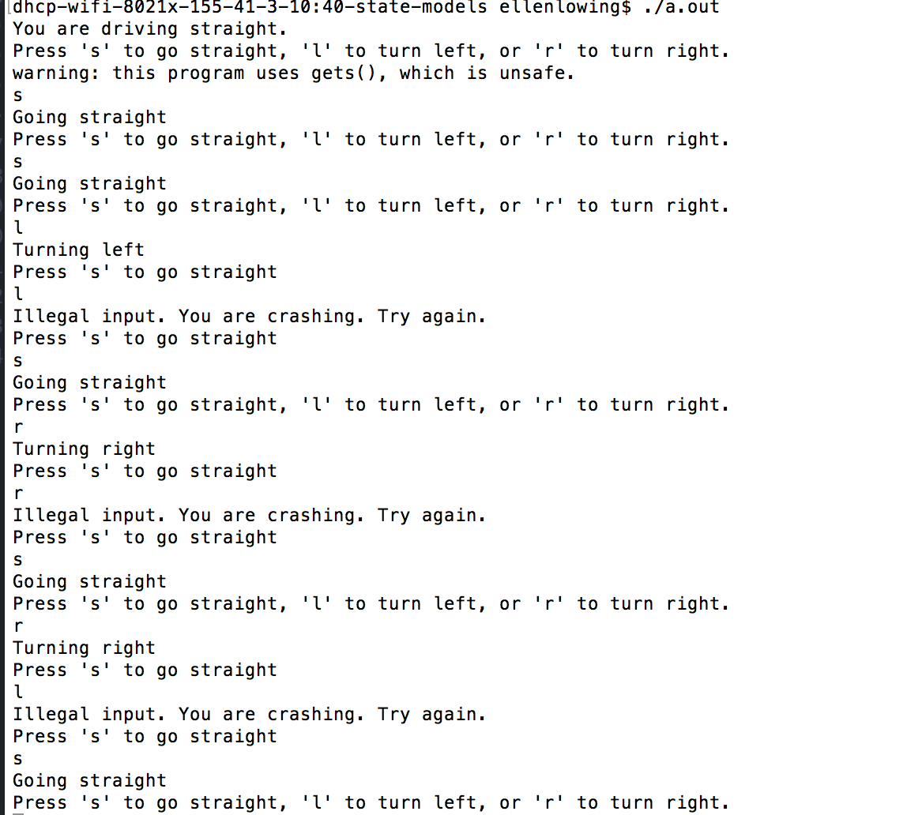
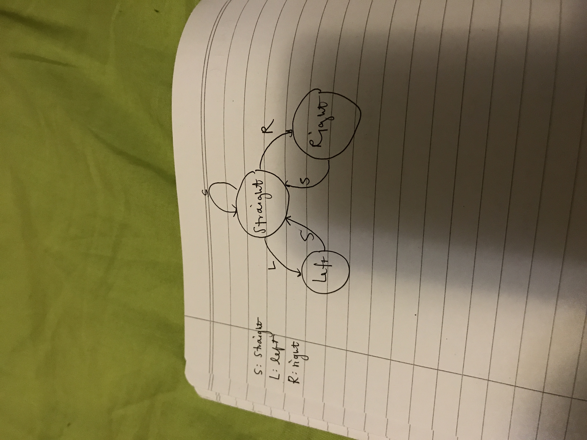

#  State models

Author: Ellen Lo, 2018-12-04

## Summary
In this skill assignment, the class was able to implement a state model for car navigation. There are three states: turning left, turning right, and going straight. There are also three kinds of input: turning left, turning right, and going straight. When it's at STRAIGHT state, all inputs are allowed. Otherwise, only GOING STRAIGHT input is allowed so program reprompts input from user.

## Sketches and Photos
#### Wiring

