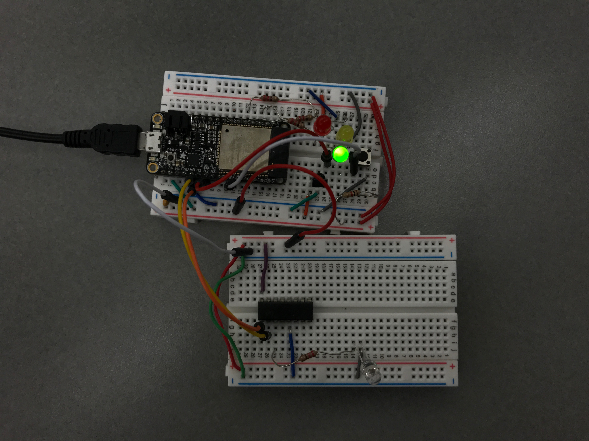

#  Leader election

Author: Ellen Lo, 2018-11-06

## Summary
In this skill assignment, the class was able to implement leader election algorithm and test it in class interactively. The state model was modeled with the Bully Algorithm.

In the video, my ESP32's ID was 18 and the others was 17, so he became the leader and mine became the follower.

## Sketches and Photos
#### Wiring

## Modules, Tools, Source Used in Solution
-[Video demo](https://youtu.be/DlQRsd_pS64)
