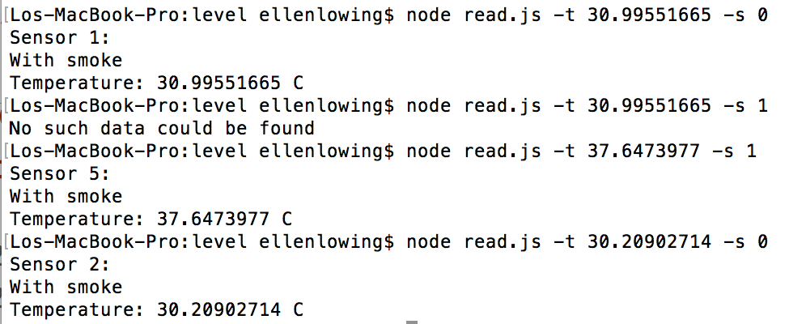

#  Database

Author: Ellen Lo, 2018-11-29

## Summary
In this skill assignment, I was able to store data and retrieve with LevelDB. In *write.js*, I used smoke.txt as data source, stored with key being its row number and values being a json object with smoke, temperature, id, and time data. In *read.js*, user inputs with temperature and smoke data as such *node read.js -t 30.20902714 -s 0* and finds matching data with entries in database and outputs corresponding sensor id. If no entry is found, it outputs *'No such data could be found'*. 

## Sketches and Photos
#### Console output

## Modules, Tools, Source Used in Solution
-[LevelDB](https://github.com/Level/level#createReadStream)
