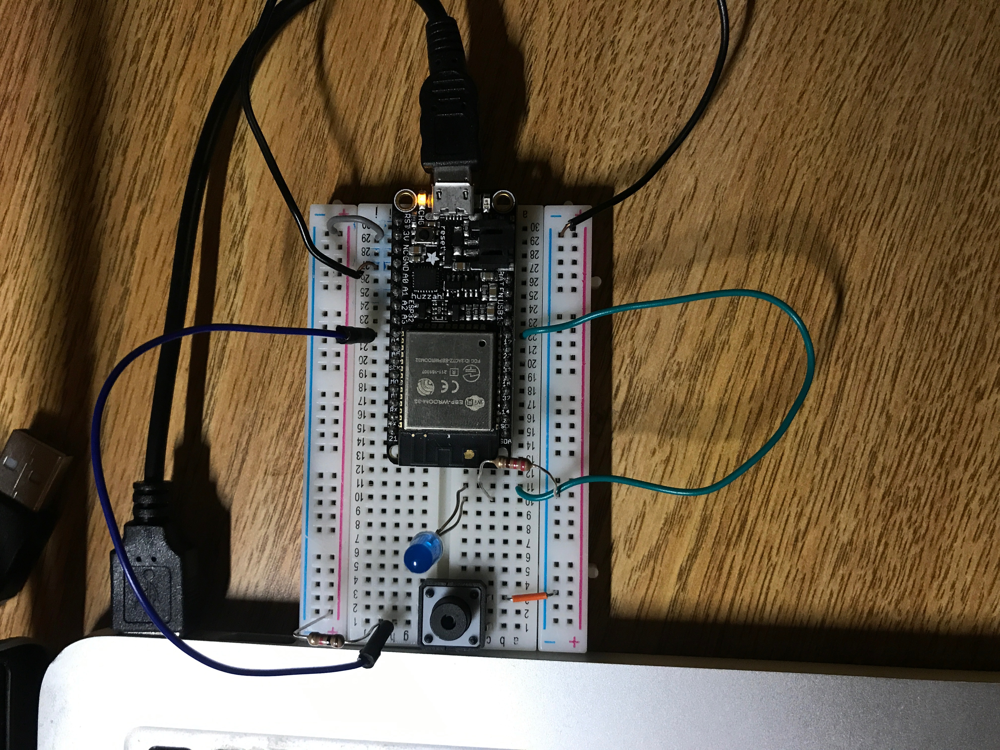
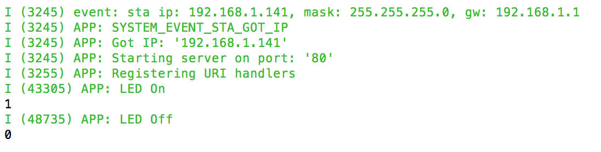
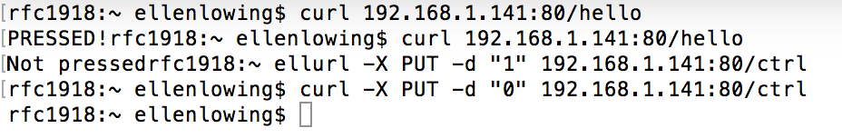

#  HTTPD server

Author: Ellen Lo, 2018-12-14

## Summary
In this skill assignment, I made slight modifications to httpd server code from quest 3 to demonstrate the ability of the huzzah board to respond to HTTP GET and PUT request. To control LED, `curl -X PUT -d "1" 192.168.1.141:80/ctrl` is the command used to make PUT request to server and it turns LED on. `curl -X PUT -d "0" 192.168.1.141:80/ctrl` turns LED off. I am also able to get the state of button push from esp 32. By reading the current state of button through gpio_get_level function, `curl 192.168.1.141:80/hello` prints "PRESSED!" and "Not pressed" that corresponds to current button push state.

## Sketches and Photos
#### Wiring

#### Console of ESP32

#### Console output of curl

## Modules, Tools, Source Used in Solution
-[Video demo](https://www.youtube.com/watch?v=w2ltofdI4-E)
