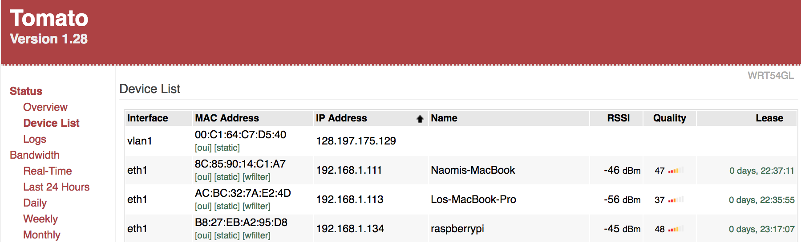

#  Raspberry Pi

Author: Ellen Lo, 2018-12-14

## Summary
In this skill assignment, I made slight modifications to web server code for quest 5 and successfully used nodejs to start web server on raspberry pi. In the video demo, you can see that the website was not accessible before starting the server on the ssh'ed raspberry pi terminal. After starting server, node started listening on port 1111 and the video shows that we're able to access the website with raspberry pi's ip address (192.168.1.134 in this case) and port number 1111.

Because editing through command line within pi is challenging, I wrote and tested the code on laptop, uploaded the code to a public github repo, and pulled it on the pi. The public github repo is available in the links provided below. A copy of the source files was also provided in this skill repo.

## Sketches and Photos
#### Successful wifi connection

## Modules, Tools, Source Used in Solution
-[Video demo](https://youtu.be/Hdg1zdxN9R8)
-[Public github repo](https://github.com/ellenlowing/ec444-q5-server)
